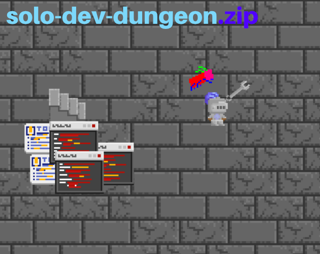
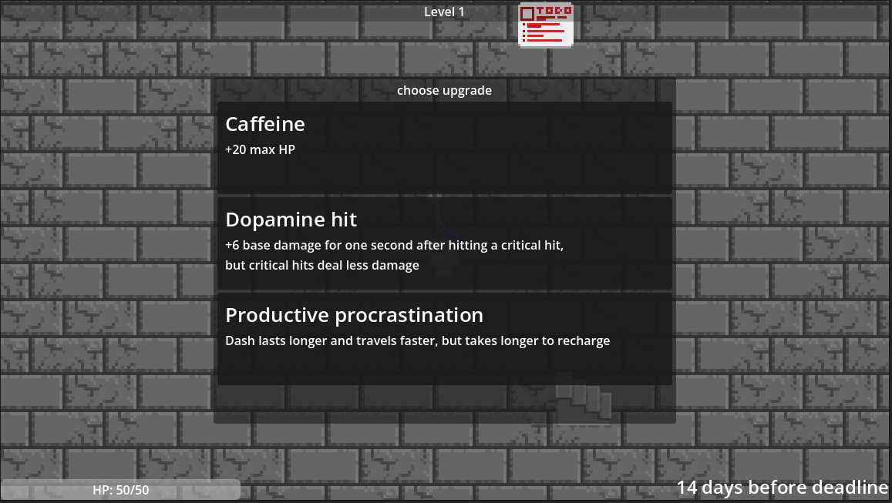

# solo-dev-dungeon.zip

play the game at [https://haohaohaoyan.itch.io/solo-dev-dungeon-zip!!!!](https://haohaohaoyan.itch.io/solo-dev-dungeon-zip)

Meh and kind of rushed game built off of a roguelike floor generator I designed a few months ago and didn't know what to do with. I wanted to do some interesting
game design and the thing I wanted to emphasize was paying attention to the enemies. I intentionally made them hit hard, but it is quite obvious when they are 
going to attack, they're pretty predictable, and dashing out of their attack at the right time rewards you with extra damage (or healing, with upgrades). One of the other
things I decided to add was the choice between tackling the enemies and just skipping the floor instead. Unlike in other roguelikes, there's nothing stopping you
from just beelining to the next floor and conserving HP, but that means you're missing out on experience for upgrades. The current upgrade selection is lackluster, 
but I'm looking to improve it in the future (if I even remember about this project)

I decided the theme at the last minute: a parallel of game development with regular floors being replaced with "days", the final boss/top of the 
tower being replaced with the deadline, and your HP is replaced with motivation. Lose all of your HP and you abandon the project, lost to time. 
The enemies are things that you usually have to do, like fixing bugs, implementing features, and figuring out errors. All of this is
framed in a medieval setting, reminiscent of regular dungeons. (Attacking also kind of reminds me of the TF2 Engineer, to the point where the weapon
indicator is a wrench.)

This project was built for Hack Club's Horizons series of hackathons, specifically to qualify for the Polaris hackathon.

Be warned though, it's not playtested thoroughly and there's a good chance there are some balance issues. Here are the current edits recommended by the 3 people who have played so far:
- Slow down medium enemy
- Add instructions that are really in your face (friend skipped over title screen and didn't know how to attack)

### Why did I make the game? For fun, really. Playing too much Hades helped too.

### Development:
I didn't actively journal during this project (I thought it wasn't required) but here are some of the things I'm proud of implementing and how I made them:
- The floor generation system kind of works like those rock candy kits. It starts with a single tile at the center of the scene. Since you can check adjacent tiles in Godot, I have a function that goes through all existing tiles, checks if it has any adjacent blank tiles, and there is a set chance for each of those tiles to be added to the floor. 
- The player & staircase locations are determined by using the floor generation function multiple times, and then storing the locations of the last tile generated after those functions (which I can get by adding all added tiles to a list whenever the function is ran)
- Enemies are actually a bunch of scriptless instanced scenes, puppetted by a master node for every enemy type that handles spawning & decisions for those enemies. I hoped that this would make it slightly more efficient, but I'm not sure about that.
- Instead of having a fat if chain for deciding between enemy types, I used an autoload script that has dictionaries full of information and attack functions for each enemy. The base enemy scene is pretty abstract and the enemy master fills in all of the data from the dictionary for that specific enemy. The enemy master also directly calls the attack behavior for the enemy instead of having to loop through things. This would probably have larger gains if there were more enemy types.
- The upgrades are stored in another autoload (for convenience, I can access it directly without much other code). When you pick an upgrade, that upgrade has stat changes that are added or subtracted from the base player stats. Instead of having the upgrades handle things, the base player already has all of the upgrade functions in place. They're all just switched off or completely ineffective (healing or increasing attack by 0) until an upgrade changes that.
- The smear frames on the boss's attacks are actually just a few ellipses cropped to fit the weapon.
- The floor tiling is created with Godot terrains (my beloved) and they are organized at the end of floor generation. Since Godot randomly chooses between two tiles with the same terrain rules, I had the center floor tiles generate with cracks 50% of the time because otherwise it would have looked boring.
Problems I faced:
- No audio. I'm going to let that slide for now because I'm a horrible sound designer but I'll get to it one day, if I remember.
- Very tight time window for development. I started at the start of July and my deadline was the 20th, so I had to really lock in on the last few days (procrastination, despite spending 2 hours per day on programming)
- The player and staircase can sometimes be generated outside the map. I'm trying to fix this by generating more tiles and making the floor larger after spawning both, but I'm not sure if this is working because of how rare this bug is.
- The balance isn't great, but I'm getting it tested and getting feedback from my friends. The upgrade selection also isn't great, but that's because I didn't have much time.
- The background didn't have good contrast with the player & stairs, but that's fixed by making it a few shades darker and removing detail.
- Spawning damage labels used to take a lot of processing on the physics process (almost doubling it) but I deferred their spawning to the main process and used object pooling to keep physics process at a stable 0.8ms most of the time. The damage number object pool starts empty and a new label has to be made when there isn't enough, but they're kept around and reused so the performance really only is worse within the first few seconds of gameplay.
- Playtesting wasn't done early enough before submission. It should work, but I haven't gotten enough people to test it. 

### Instructions:
These are actually listed in the game itself.
- WASD for basic movement
- Left-click/M1 for attacking. 
- Right-click/M2 to dash for temporary invulnerability and a longer distance. 
- Dash away just before an enemy hits you for a temporary boost in attack damage
- Spacebar to ascend stairs

### "Tech stack":
- Godot for pretty much everything. The game is programmed in GDScript. Heck, even this README is written in Godot. 
- Aseprite developer build for art. (You can clone their Github repo and then compile it with their guide to just kind of have it for free)
- GIMP for boss texture. The resolution change on it is intentional. I think I've been looking at that one Terraria boss a bit too much for inspiration.

## No AI was used in this project. Why have a robot program for me when programming is the fun part? This is MY game.
